# AiF-core - Система мониторинга призовых и торговых автоматов

Современная админ-панель для управления системой мониторинга призовых и торговых автоматов, построенная на React, TypeScript и Ant Design Pro.

## ДЕМО

Можно описывать проект миллионом слов, а можно просто пойти в [демо](https://demo.aif-tech.ru) и попробовать самому. 

> Данные сбрасываются каждый час. 

## 🚀 Возможности
| Десктоп | Мобильная версия |
|---|---|
|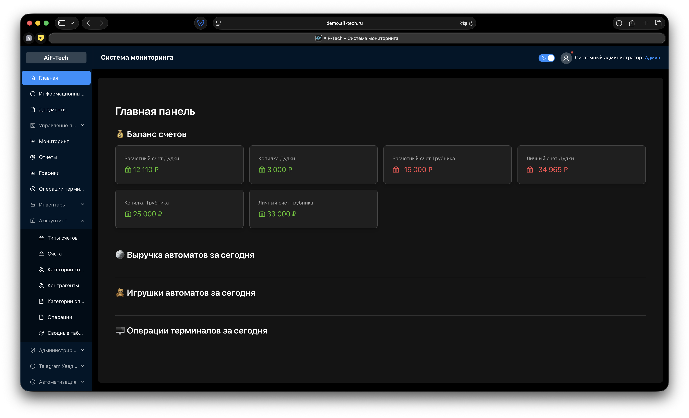|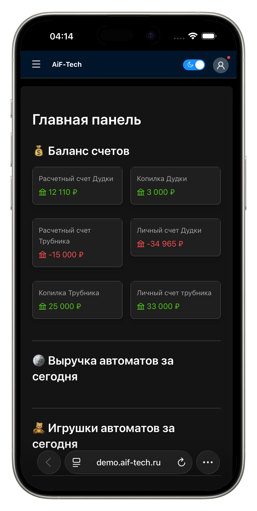|
|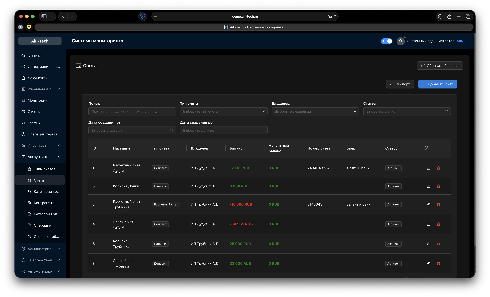|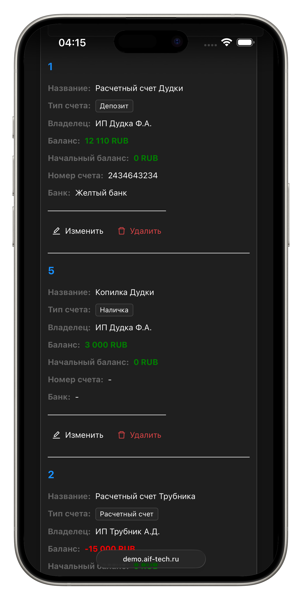|
|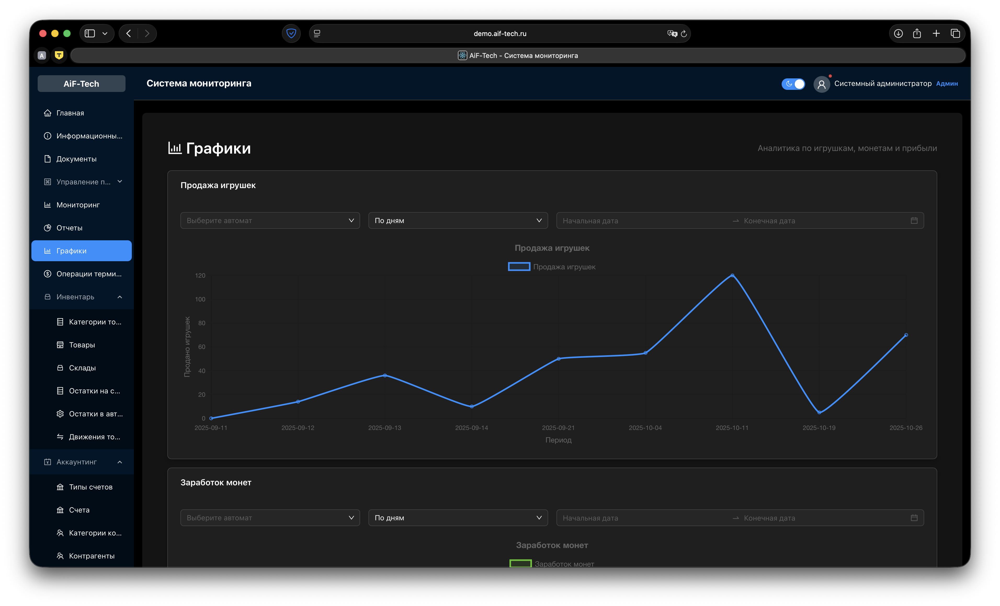|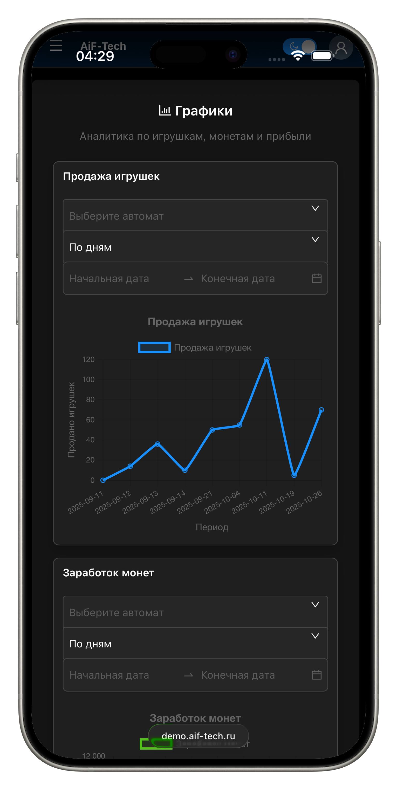|
|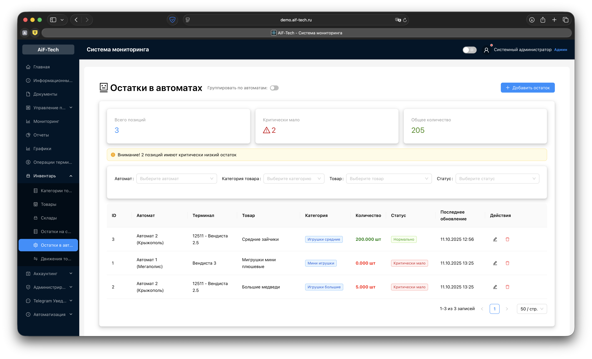|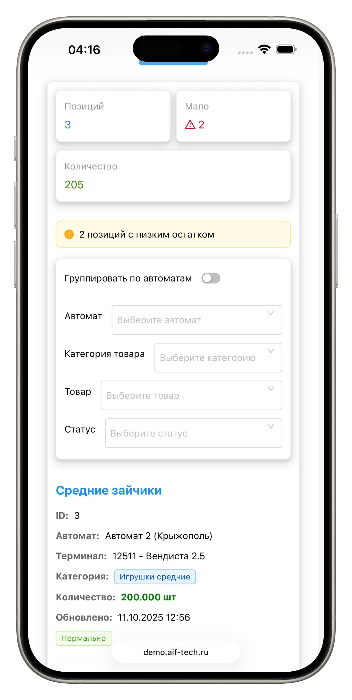|
|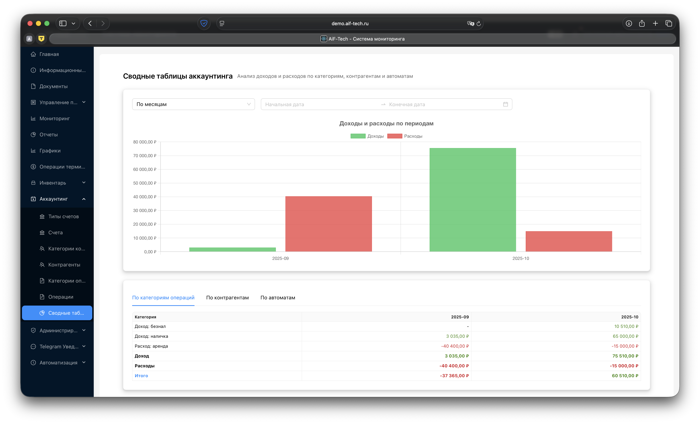||
|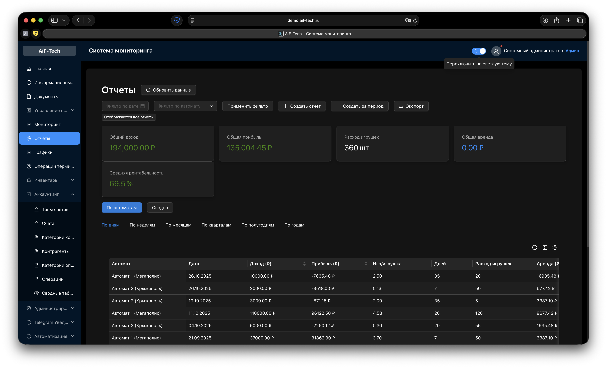|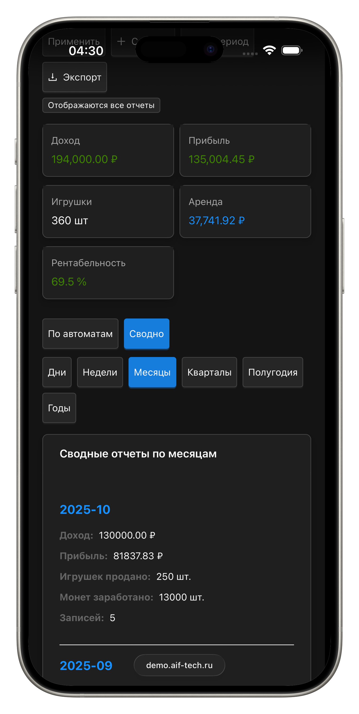|


- **Управление владельцами** - создание, редактирование и удаление владельцев терминалов, автоматов и тп. 
- **Управление терминалами** - настройка терминалов с привязкой к владельцам
- **Управление машинами** - добавление призовых автоматов к терминалам
- **Мониторинг** - отслеживание доходов, игрушек и транзакций
- **Управление телефонами** - ведение учета телефонных платежей
- **Управление ценами** - настройка цен на игры
- **Управление арендой** - учет арендных платежей
- **Дашборд** - общая статистика и быстрые действия
- **Инвентарь** - система управления складскимми запасами и остатками в автоматах
- **Аккаунтинг** - система учета доходов и расходов
- **Уведомления** - отчеты в телеграм о разных событях 
- **Общие информационные карточки** - чтобы закреплять частую и важную информацию для пользователей, в том числе и секреты 
- **Документы** - Хранение документов в том же месте, где и ведется работа над бизнесом 

## 🛠 Технологии

### Frontend
- **React 18** - основная библиотека
- **TypeScript** - типизация
- **Ant Design** - UI компоненты
- **Ant Design Pro** - компоненты админ-панели
- **React Router** - маршрутизация

### Backend
- **FastAPI** - веб-фреймворк
- **SQLAlchemy** - ORM
- **PostgreSQL** - база данных
- **Pydantic** - валидация данных
- **JWT** - аутентификация
- **MinIO** - объектное хранилище

## 🚀 Быстрый старт

### Предварительные требования

- Node.js 16+ 
- npm или yarn
- Docker и Docker Compose
- Python 3.12+ (для разработки)

### 1. Клонирование и установка

```bash
# Клонирование репозитория
git clone <repository-url>
cd aif-core

sh build-frontend-custom.sh / 
cp -r ./frontend-build/* /var/www/html
```

### 2. Запуск с Docker

```bash
# Запуск всех сервисов
docker-compose up -d

# Проверка статуса
docker-compose ps
```

Сервисы будут доступны по адресам:
- **Frontend**: nginx root path
- **Backend API**: http://localhost:28000
- **MinIO Console**: http://localhost:9001
- **PostgreSQL**: localhost:5432

## 📱 Адаптивность

Админ-панель полностью адаптивна и корректно отображается на:
- Десктопах
- Планшетах
- Мобильных устройствах

## 🎨 Особенности интерфейса

- **Темная боковая панель** с навигацией
- **Современный дизайн** в стиле Ant Design
- **Русская локализация** всех элементов
- **Интуитивная навигация** между разделами
- **Быстрые действия** на главной странице
- **Поиск и фильтрация** во всех таблицах
- **Пагинация** для больших объемов данных

## 📊 Функциональность

### Дашборд
- Статистика по количеству владельцев, терминалов и машин
- Общий доход от всех автоматов
- Последние записи мониторинга
- Быстрые ссылки на основные разделы

### Управление данными
- **CRUD операции** для всех сущностей
- **Валидация форм** с понятными сообщениями об ошибках
- **Подтверждение удаления** для предотвращения случайных удалений
- **Связи между таблицами** (владельцы → терминалы → машины)

### Мониторинг
- Отслеживание доходов в реальном времени
- Статистика по игрушкам и транзакциям
- Фильтрация по датам и машинам

## 🔒 Безопасность

- Валидация всех входных данных
- Защита от XSS атак
- Безопасная работа с API
- Подтверждение критических операций

## 📈 Производительность

- Ленивая загрузка компонентов
- Оптимизированные запросы к API
- Эффективная пагинация


## 🔧 Конфигурация API

По умолчанию приложение настроено на работу с API по адресу `http://localhost:3001/api`.

Для изменения URL API создайте файл `.env` в корне проекта:

```env
REACT_APP_API_URL=http://your-api-url.com/api
```

## 🚀 Сборка для продакшена

```bash
npm run build
```

Или воспользоваться контейнером для сборкии 

```bash
sh build-frontend-custom.sh / 
```

Собранные файлы будут в папке `frontend-build/`

## 🤝 Разработка

### Добавление новых функций

1. Создайте новый компонент в `src/pages/`
2. Добавьте маршрут в `src/App.tsx`
3. Добавьте пункт меню в `src/components/Layout.tsx`
4. Создайте API сервис в `src/services/api.ts`
5. Добавьте типы в `src/types/index.ts`

### Структура компонентов

Каждая страница содержит:
- Таблицу с данными (ProTable)
- Модальные окна для создания/редактирования
- Формы с валидацией
- Обработку ошибок
- Уведомления пользователю

## 📄 Лицензия

MIT License

## 👥 Поддержка

Для получения поддержки или сообщения об ошибках создайте issue в репозитории проекта.

## 🎯 Демо данные

Приложение поставляется с демо данными:
- 2 владельца
- 2 терминала
- 3 призовых автомата
- Записи мониторинга
- Примеры цен и аренды

Все данные хранятся в памяти бэкенда и сбрасываются при перезапуске сервера.

### Бухгалтерский учет
- Управление типами счетов и счетами
- Категории контрагентов и контрагенты
- Категории транзакций
- Полное управление транзакциями с расширенной фильтрацией

